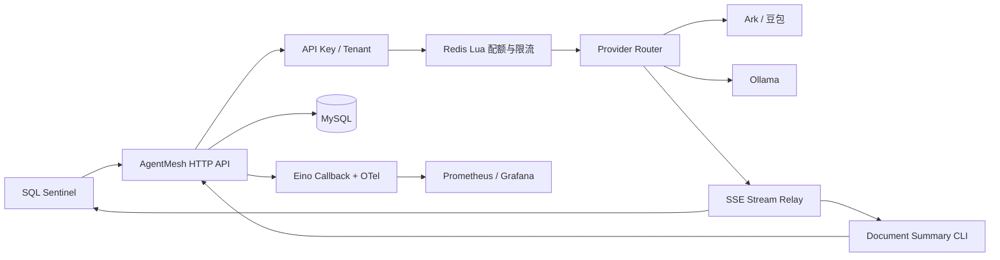
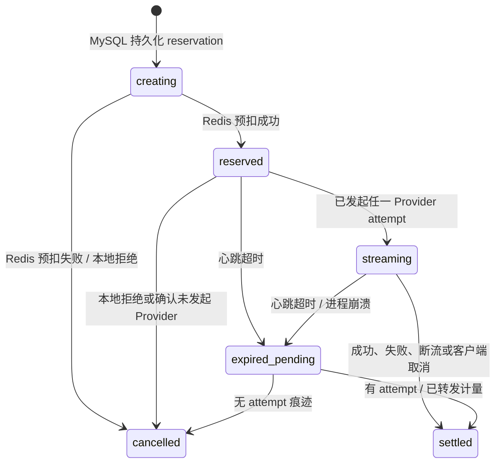

# AgentMesh：多租户 LLM 网关与 Agent Runtime

## 1. 项目目标

AgentMesh 是面向多个 AI 应用的 Go 模型运行时。它统一处理模型 Provider 接入、流式转发、租户鉴权、Token 配额、限流和调用观测，让业务 Agent 专注于自身逻辑。

首版接入两个独立客户端：

1. SQL Sentinel；
2. 一个极简文档摘要 CLI。

这证明它是可复用平台，而不是 SQL Sentinel 的内部工具。

## 1.1 当前可运行切片（001）

当前仓库已提供一个**仅本机、仅 mock** 的最小 SSE 网关，以及两个通过 HTTP 使用它的 CLI。它用于验证
Provider 路由、首块前 fallback、SSE 转发和取消传播；不表示 Ark/豆包、Ollama、API Key、Redis、MySQL、
配额或账单已接入。

在第一个终端启动（只接受 `127.0.0.1:PORT`，拒绝局域网和通配监听）：

```powershell
go run ./cmd/api --addr 127.0.0.1:18080
```

在另一个终端分别运行两个客户端：

```powershell
go run ./cmd/summary-cli --text 'AgentMesh streams local mock output.'
go run ./cmd/sql-diagnose-cli --sql 'SELECT id FROM users WHERE status = ''active'''
```

两条命令都会得到 `mock response`。默认 primary mock 在首个 SSE 数据块前失败，Router 因而使用 fallback mock；
若已经转发任一数据块，后续失败只产生 `stream_interrupted`，绝不切换模型。SQL CLI 只把 SQL 当作提示文本，
不会执行 SQL。没有密钥、真实模型调用或 Docker 操作。

## 1.2 真实 Provider Adapter（002）

Ark 与 Ollama Adapter 已具备离线 fixture 测试，但默认仍为 `--providers mock`。只有操作者显式选择
`--providers ark,ollama` 时，服务才读取以下进程环境变量：`ARK_BASE_URL`、`ARK_MODEL`、`ARK_API_KEY`、
`OLLAMA_BASE_URL`、`OLLAMA_MODEL`。不要把这些值写入 flags、配置文件、日志、终端录制或 Git。

```powershell
go run ./cmd/api --providers ark,ollama
```

任一必填值缺失或格式无效时，服务在创建 HTTP client 前以 `provider_configuration_missing` 或
`provider_configuration_invalid` 退出，且不会尝试 Provider 网络连接。`GET /health/providers` 只返回当前
Provider 的名称和布尔健康状态；它不返回 endpoint、模型或密钥，且 health 成功不等于一次 chat 流成功。

本仓库在 2026-08-28 的受控 T003 运行中，五个必需环境变量均不存在；上述命令实际返回
`provider_configuration_missing`、exit 1，Provider 尝试数为 0。真实调用即使成功也只证明本次 Adapter
可连接，不表示已实现租户鉴权、配额、账单或精确 Token 计费。

## 1.3 本机 API Key 与租户路由（003）

003 只实现离线、本进程内存 seed：启动时从 `AGENTMESH_BOOTSTRAP_API_KEY` 派生 API Key 的 prefix 与
SHA-256 hash，内存记录绝不保存原始 key。还必须提供 `AGENTMESH_BOOTSTRAP_TENANT_ID` 和严格 JSON 的
`AGENTMESH_BOOTSTRAP_MODEL_ROUTES`（模型到 `mock` 的顺序声明）。原始值只能由当前 shell 的安全方式临时
生成；不得写入 flags、文件、日志、终端录制或 Git。两个 CLI 只从 `AGENTMESH_API_KEY` 读取同一原始值，并发送
`Authorization: Bearer`，不提供 key flag。

`POST /v1/chat/completions` 和 `GET /health/providers` 现在都需要认证；缺失、畸形、未知或禁用 key 统一返回
401 `auth_failed`，且不会读取 chat body 或调用 Provider。认证后才解码 chat 请求：tenant 未允许该 model 返回
403 `model_not_allowed`，仍为 0 Provider attempt。`GET /health/providers` 只显示当前 tenant 至少一个模型允许的
Provider 名称及健康状态；`GET /healthz` 仍是唯一公开端点。

tenant route 只是逻辑名称声明，实际 Adapter 始终由 002 的 `runtime.Build` 创建。启动前会拒绝 mock 与真实
Provider 混排、乱序或越出全局 Provider 集合的 tenant route。默认 `QuotaGate` 仍为 allow-only 开发切片；006 的
持久 Reservation 只有显式设置 `AGENTMESH_QUOTA_MODE=reservation` 后才启用。

2026-08-28 的 T003 受控本机运行使用一次性的随机 key（未落盘），以 `mock-model → mock` 启动
`127.0.0.1` 网关：两个 CLI 均实际输出 `mock response`；无 Bearer 请求返回 401 `auth_failed`；有效 key 请求
未授权 model 返回 403 `model_not_allowed`。注入式 QuotaGate 测试证明 429 `quota_exhausted` 路径为 0 Provider
attempt，但默认进程不会声称配额已启用。该运行未使用真实 Provider 或 Docker。

## 1.4 安全 Trace 与内存 Usage Record（004）

每个通过认证、且能进入 tenant/model 路由的 chat 请求都会由服务端生成不可预测的 trace ID，并在响应开始 SSE
前通过 `X-AgentMesh-Trace-ID` 返回。随后可使用同一个 API Key 查询：

```text
GET /v1/observability/traces/{trace_id}
Authorization: Bearer <当前进程的临时 key>
```

查询只返回当前 tenant 的安全摘要：model、Provider attempt 名称/结果、首块与总耗时、稳定结果码、取消状态和
Provider 明示的 usage。它绝不返回 tenant ID、prompt、messages、SSE delta、raw key/prefix/hash、endpoint 或
Provider 原始错误；usage 没有被 Provider 明示时固定为 `usage_observed=false`，不伪造 Token 估算。跨 tenant、
未知和未完成 trace 都统一为 404 `trace_not_found`，不暴露记录是否存在，也不触发 Provider。

Recorder 是固定容量、进程内的诊断环：只淘汰最早完成记录，重启即丢失；若容量里全是 pending，业务流仍继续，
但该请求的 trace 可能不可查询。它不是审计、账单、持久化 `usage_records` 表或后续 Reservation attempt 凭据，
未接 OTel、Prometheus、MySQL、Redis 或 Eino Callback。

在 Windows 本机可运行已验证的 stage-1 演示：

```powershell
make demo-stage-1
```

该 target 临时生成随机 key、仅启动 `127.0.0.1` mock 网关，分别运行两个 CLI，查询一条 trace，并执行取消传播测试；
默认 mock primary 在首块前失败、fallback 输出 `mock response`。脚本会结束进程并清理临时日志，不写入 key；不启动
Docker 或真实 Provider。公开决策记录见 `decisions/`，私有简历/面试资料不进入 Git。

## 1.5 Reservation 状态机预验证（005）

005 只验证未来配额链路的领域状态，尚未接入 Gateway 或任何真实余额：内存 Reservation 从 `creating` 进入
`reserved`，随后在没有 started attempt 时可以 `cancelled`；一旦先记录了 started attempt，首块前失败、流中断、
Context 取消或未知上游结果都只能 `settled`。`reserved` 在这里仅表示状态机通过，**不表示** Redis 已预扣、MySQL
已持久化或 tenant 余额已冻结。

每个变更携带 `reservation_id`、`expected_version` 和 operation。相同的成功操作重放返回第一次结果；同版本不同
操作或版本冲突会被拒绝，拒绝本身不会进入幂等 journal。`expired_pending` 是 future reconciler 的非终态，普通
Cancel 无法直接裁决它。内存 Repository 只用于离线语义和 race 测试：重启丢失、没有跨进程锁、没有迁移、没有
Redis Lua/MySQL/SQLite、reconciler、usage_outbox、对账或 `demo-stage-4`，因此不能作为“不透支”或生产一致性的证据。

2026-08-29 的受控测试实际通过：attempt 前取消与同操作重放、attempt 后 `reservation_must_settle`、版本/tenant
冲突、`expired_pending` 禁止普通取消，以及 32 个并发相同 `StartAttempt` 最终只留下一个 attempt。它验证的是状态边界，
不是对真实 Provider、余额或持久化系统的实验。

## 1.6 持久 Reservation 与保守结算（006）

006 增加 MySQL 8 migration `migrations/001_quota_reservations.sql`、`quota_reservations`/`provider_attempts` 持久证据、
Redis Lua 的 reserve/settle/cancel operation key，以及 Gateway 的可选 Reservation Coordinator。启用模式仅接受环境变量：
`AGENTMESH_QUOTA_MODE=reservation`、`AGENTMESH_QUOTA_MYSQL_DSN`、`AGENTMESH_QUOTA_REDIS_URL`、
`AGENTMESH_BOOTSTRAP_TENANT_QUOTA_UNITS` 与 `AGENTMESH_RESERVATION_UNITS`；密钥、DSN 和 Redis URL 绝不写入 flags、日志或 Git。
缺少配置会以 `quota_configuration_missing` 在启动前拒绝；运行中任一存储失败以 503 `quota_unavailable` 在 Provider 前拒绝。

正常顺序固定为 MySQL `creating` → Redis Lua reserve → MySQL `reserved` → 同步写入 attempt started evidence → Adapter。
流中每 16 个 SSE chunk 或 1 秒持久化一次已成功转发的 rune 下界和 heartbeat；写入失败停止后续转发。只有所有 attempt 都有
Provider 明示且非 estimated 的 usage 时才按该 usage 退款；缺失或 estimated usage 一律 `settled(estimated)`、保留全部预扣。
rune 计量是诊断和 reconciler 证据下界，**不是** tokenizer 或精确 Token 账单，也不构成退款依据。

`make demo-stage-4` 会运行可重复的离线故障演示：预扣、首块前 fallback、两次 attempt、流中断后的保守结算，以及 started
evidence 的 reconciler 裁决。演示使用确定性进程内替身，明确不接触 MySQL/Redis endpoint、Docker 或真实 Provider；它验证控制流，
不能被写成真实基础设施实验。真实 MySQL/Redis 只有操作者显式提供上述环境后才会连接；本阶段未记录一次真实 endpoint 成功。
2026-08-29 的受控本机拒绝运行设置了 reservation mode、有效内存 bootstrap tenant 与 mock Provider，但故意不设置任一
存储变量；服务实际输出 `quota_configuration_missing`、exit 1，且在配置校验前没有 MySQL/Redis 或 Provider 尝试。

## 1.7 真实 MySQL / Redis 受控验证（008）

`make verify-real-storage` 是独立于网关的 opt-in 验证器。它只接受环境变量
`AGENTMESH_REAL_STORAGE_VALIDATION=1`、`AGENTMESH_QUOTA_MYSQL_DSN`、`AGENTMESH_QUOTA_REDIS_URL` 与
`AGENTMESH_REAL_VALIDATION_NAMESPACE`；没有命令行凭据，也不会调用 Provider。四项任一缺失时，它输出 JSON
`verification_unavailable/quota_configuration_missing` 并以 exit 1 结束，网络、DDL、余额写入和 Provider attempt 都为 0。

提供配置意味着操作者确认目标是可处置的非生产 schema 和 Redis namespace。验证器只从既有 migration 补建缺失表；已有表只做
列、索引和约束形状核对，不执行 ALTER/DROP。每次运行产生独有 tenant/request/reservation 标识，实测 reserve→settle、
reserve→cancel、started 与无 attempt 两类 reconciler 恢复及重放；随后仅删除本次已知行/key，保留 migration 表。stdout 是脱敏
JSON 摘要，绝不含 DSN、URL、密码、prompt 或响应。若没有真实环境，受控拒绝是正确结果，不能改写成真实基础设施通过。
2026-08-29 本机实际执行该命令时，四项环境变量均不存在，输出为 `verification_unavailable` /
`quota_configuration_missing`、`network_attempts=0`、`provider_attempts=0`、exit 1；因此本仓库仍没有一次真实 MySQL/Redis
endpoint 成功事实。

## 2. 问题边界

### 要解决

- 多个 Agent 应用重复实现模型接入、SSE、用量统计、超时和取消的问题；
- 不同租户的 API Key、并发和 Token 预算隔离问题；
- 上游模型首字节前故障时的可控降级；
- 模型调用缺少可观测性，无法定位慢请求、失败和成本的问题。

### 首版不解决

- 不复刻 One API 或 Higress 的完整能力；
- 不实现三个以上 Provider；
- 不实现流式输出开始后的无缝模型切换；
- 不做语义缓存、复杂账单、Kubernetes、多 Agent 市场。

## 3. 总体架构



## 4. 关键设计

### 4.1 多租户与权限

- API Key 只保存哈希值和前缀；明文只在创建时返回一次；
- 每个 Key 绑定 `tenant_id`、可用模型、速率上限和 Token 周期预算；
- JWT 用于管理后台登录；Casbin 控制平台管理员、租户管理员和开发者的管理权限；
- 业务调用只凭 API Key，不把 JWT 混入服务间接口。

### 4.2 Provider 路由与降级

- V0 支持 Ark/豆包与 Ollama；路由依据租户允许列表、显式模型选择和健康状态；
- 在第一个 SSE 数据块发送给客户端前，上游连接失败可以尝试备用 Provider；
- 首 Token 已发送后禁止切换 Provider。此时返回规范化流错误，由客户端发起“重新生成”；
- 每次 Provider attempt 都单独记录并累计用量；首 Token 前重试不覆盖第一次 attempt 已产生的 input 成本；
- Provider 实现通过 Adapter 隔离，路由通过 Strategy 实现，不泄漏到业务层。

### 4.3 SSE、超时与取消

- 每个 HTTP 请求创建根 `context.Context`；客户端断连、超时或主动取消时向下游传递取消；
- 上游 HTTP 请求、Eino Stream、内部 goroutine 都监听同一派生 Context；
- 流结束时统一关闭 channel、停止计时器、回收临时资源；
- 测试通过主动断开 N 次 SSE 连接后，验证 goroutine 数回到稳定基线。

### 4.4 配额与限流

- Redis Lua 在单次脚本中检查与扣减 Token 预算，避免并发下超额；
- 令牌桶限制单位时间请求数；
- V0 只验证预扣与正常路径结算；V1 补齐 Reservation 状态机、崩溃恢复和异步账单，不能把 V0 当成生产级计费链路；
- 对流式请求，预扣保守预算；只有完整 Provider usage 可用时按其结算。不可用时保存已转发 rune 的“本地可观测下界”，标记 estimated，但不以此证明可退款或精确 Token 账单；
- 用量账单通过 outbox 异步写 MySQL，热路径不做重型聚合。

### 4.5 Reservation 状态机（V1）

Reservation 的终态只有 `settled` 与 `cancelled`；`expired_pending` 是等待 reconciler 裁决的中间状态，不是终态。



- `cancelled` 只适用于配额/限流拒绝，或能确认 Provider attempt 从未发起的本地失败；
- 任一 attempt 发起后，即使首字节前失败、流中断或客户端取消，也必须 `settled`；释放的只能是确定未使用的预约额度；
- `provider_attempts` 的“已发起”标记必须在调用 Provider Adapter 前持久化；一旦 Adapter 调用已经开始，哪怕网络错误无法判断请求是否到达上游，也保守地按 `settled` 处理；
- fallback attempt 的 input 与已转发 output 用量累加，路由器在下一次 attempt 前重新检查 Reservation 剩余额度；
- `quota_reservations` 在发起 Provider 前持久化 `reservation_id`、`request_id`、状态、attempt 痕迹、已转发文本/本地 Token 计量、心跳和版本号；reconciler 据此幂等裁决；
- Provider 未提供 usage 时，本地计量只反映网关确认已发送/转发的内容；其不足以证明剩余额度未被上游消耗，因此本阶段不退款，并把终态标为 `settled(estimated)`。

### 4.6 可观测性与版本化

- 使用 Eino Callback 记录模型、Provider、模型版本、Prompt 版本、Token、首 Token 延迟、总耗时、错误与取消原因；
- 通过 OpenTelemetry 贯穿 trace_id，Prometheus 暴露指标；
- 敏感 Prompt、参数和响应只记录脱敏摘要或经过加密、访问审计后的内容；
- 评测和成本统计绑定 `model_version + prompt_version + dataset_version`。

## 5. 技术栈与选型理由

| 技术 | 用途 | 为什么需要 |
| --- | --- | --- |
| Go / net-http / Context | API、SSE、取消传播 | 流式模型调用本身要求长连接与资源回收 |
| Eino / Eino Ext | 模型适配、流和 Callback | 避免业务直接耦合具体 Provider |
| Go-zero | 管理面 REST API、中间件 | 管理端是标准的配置与权限接口 |
| MySQL + `database/sql` | Reservation/attempt 持久证据 | 版本条件更新与可恢复的配额状态；未引入 ORM |
| Redis + Lua | 限流、Token 预扣与结算 | 原子扣减和高频热路径 |
| JWT + Casbin | 管理面鉴权与 RBAC | 多租户后台必须区分操作权限 |
| Viper + Zap | 多环境配置、结构化日志 | Provider 配置和故障定位需要规范化 |
| OTel + Prometheus | Trace、指标、告警 | 验证延迟、失败、取消和成本 |
| Docker Compose | 本地运行 Ark Mock、Ollama、Redis、MySQL | 一键复现开发和测试环境 |

`gRPC` 不是首版必选。只有 AgentRunner 被独立为进程且需要同步强类型调用、进度流和跨进程取消时才引入。

## 6. 数据模型（建议）

- `tenants`：租户信息、状态、默认配额；
- `api_keys`：Key 前缀、哈希、所属租户、权限与状态；
- `model_routes`：租户可用模型、优先级、故障策略；
- `quota_reservations`：请求 ID、预扣额度、状态、attempt 痕迹、本地计量、心跳、版本；
- `provider_attempts`：每次路由/降级尝试的 Provider、模型、开始时间、usage 与错误；
- `usage_records`：请求 ID、模型、Token、计费单位、延迟、结果；
- `usage_outbox`：与 Reservation 状态一同提交的异步账单事件；
- `prompt_versions`：版本号、模板摘要、状态、发布时间。

## 7. API（建议）

- `POST /v1/chat/completions`：OpenAI 风格模型调用，支持 `stream=true`；
- `POST /v1/agent/runs`：规划接口，V0 不实现；只有确需托管 Agent 生命周期时再引入；
- `POST /admin/api-keys`：创建 Key；
- `GET /admin/usage`：按租户和模型查询用量；
- `GET /health/providers`：Provider 健康状态。

## 8. 验收与指标

使用本地 mock Provider 单独测网关能力，真实模型只记录端到端体验：

- 网关自身增加的 P99 延迟；
- 固定并发下成功率、错误分类和限流正确率；
- 首 Token 前降级成功率；
- 主动断连后的取消传播时间和 goroutine 泄漏测试；
- 租户 A/B 配额隔离测试；
- 同一租户 1000 并发预扣测试：Redis Lua 结果不能透支预算；
- Token 预扣和最终结算一致性。
- Reservation 崩溃恢复、重复结算/取消幂等和 Provider usage 差异标记（V1）。

## 9. 推荐目录

```text
agentmesh/
  cmd/{api,summary-cli}/
  internal/{auth,tenant,quota,router,provider,stream,usage,observability}/
  pkg/{einoadapter,contracts}/
  migrations/
  deployments/docker-compose.yml
  tests/
```
